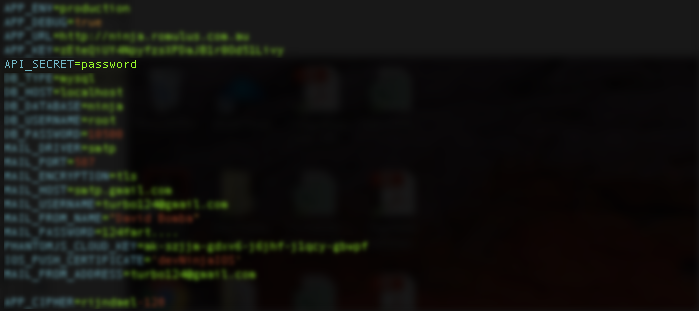

iPhone Application
==================

The Invoice Ninja iPhone application allows a user to connect to their self-hosted Invoice Ninja web application.

Connecting your iPhone to your self-hosted invoice ninja installation requires a couple of easy steps.

Web app configuration
"""""""""""""""""""""

Firstly you'll need to add an additional field to your .env file which is located in the root directory of your self-hosted Invoice Ninja installation.

The additional field to add is API_SECRET, set this to your own defined alphanumeric string.

Save your .env file and now open Invoice Ninja on your iPhone.

iPhone configuration
""""""""""""""""""""

Once you have completed the in-app purchase to unlock the iPhone to connect to your own server, you'll be presented with two fields.

The first is the Base URL of your self-hosted installation, ie http://ninja.yourapp.com

The second field is the API_SECRET, enter in the API_SECRET you used in your .env file.

.. image:: images/iphone_self_hosted.png

Click SAVE.

You should be able to login now from your iPhone!

FAQ:
""""

Q: I get a HTTP 500 error.

A: Most likely you have not entered your API_SECRET in your .env file

Q: I get a HTTP 403 error when i attempt to login with the iPhone.

A: Most likely your API_SECRET on the iPhone does not match that on your self-hosted installation.

Q: Do I need to create a token on the server?

A: No, this is not required. The server will automagically create a token if one does not exist on first login.
